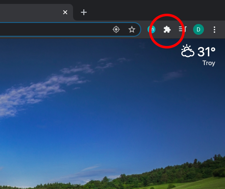
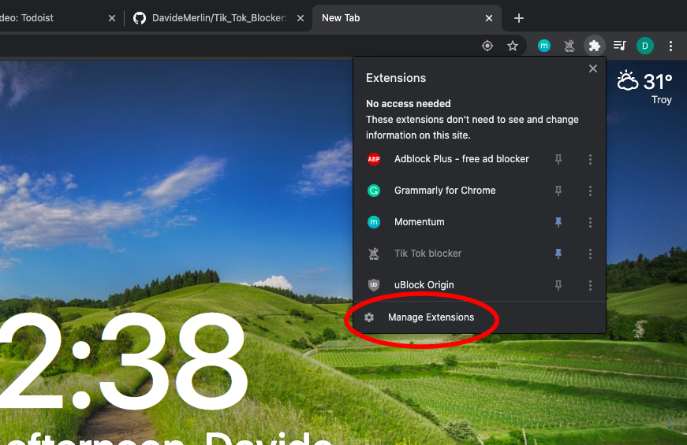
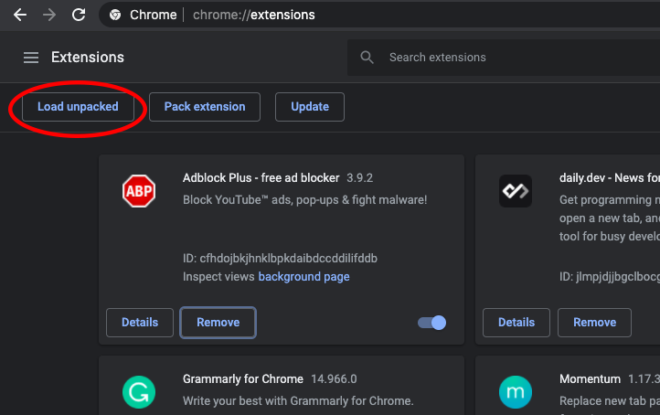
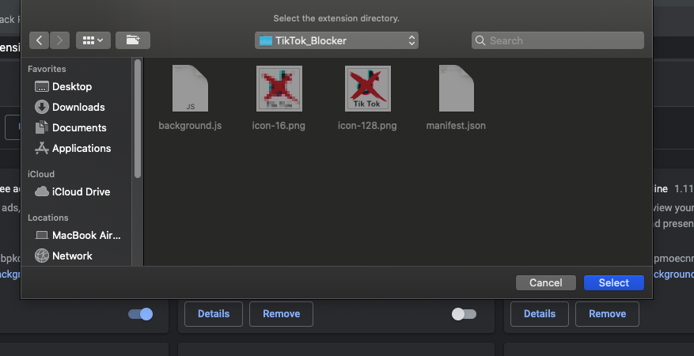
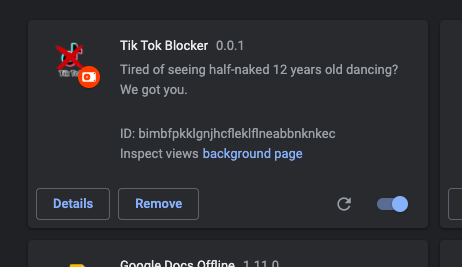

# Tik Tok Blocker


Tik Tok Blocker is a very useful extension to stop you from visiting tiktok.com

## How to install the extension

Clone the repository to your location of preference by using:

```bash
git clone https://github.com/DavideMerlin/Tik_Tok_Blocker.git
```

Then, go to chrome and click on the extension icon



Click on "Manage Extensions"



Now, you should see a "Load unpacked" option on the upper-left part of the screen. Click on it. 



You want to select the repository folder where you just downloaded the code, and click "select"



You're all set! Enjoy!

